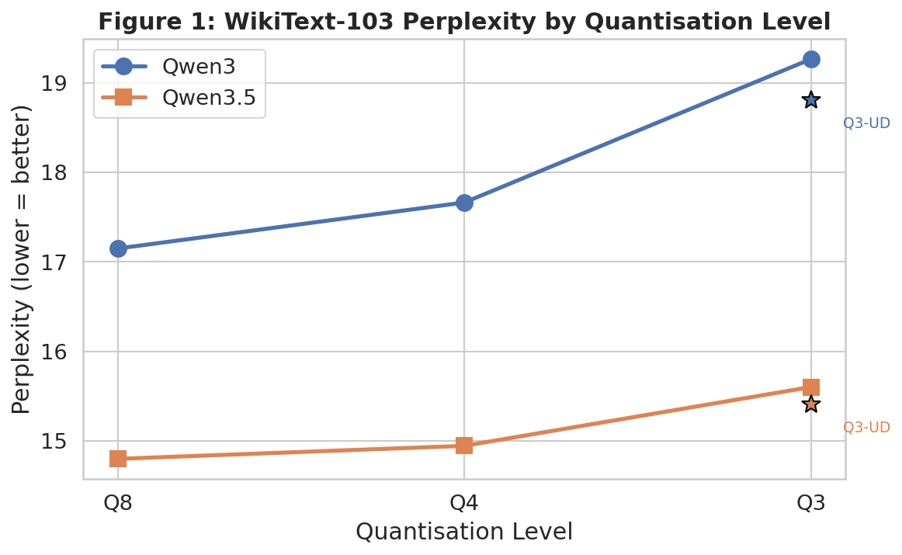
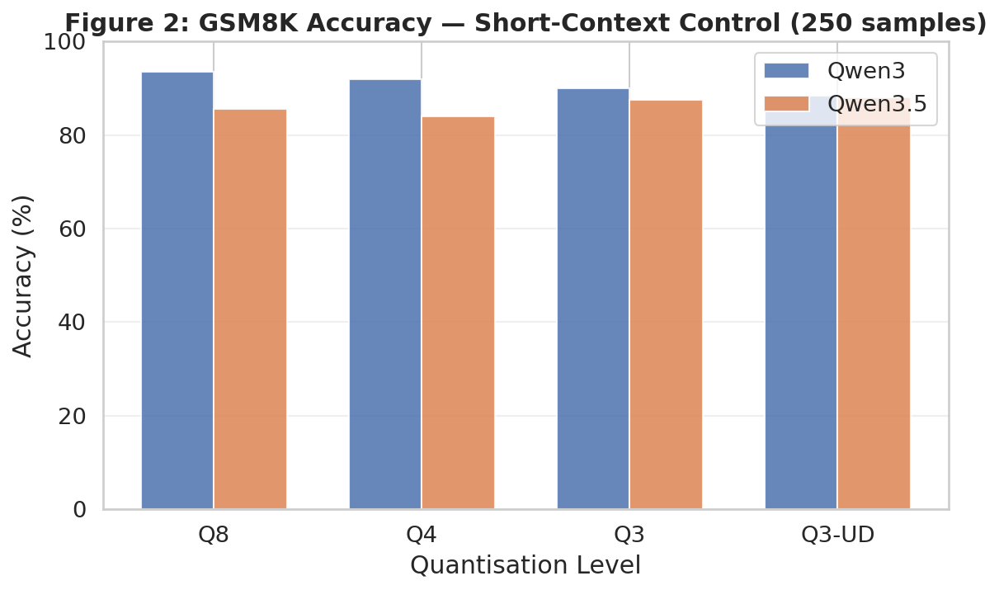
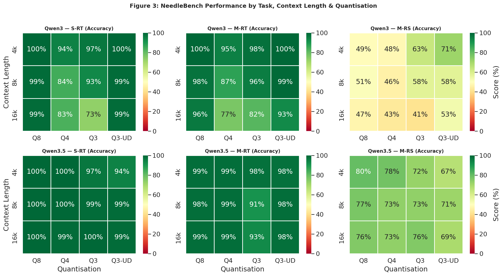
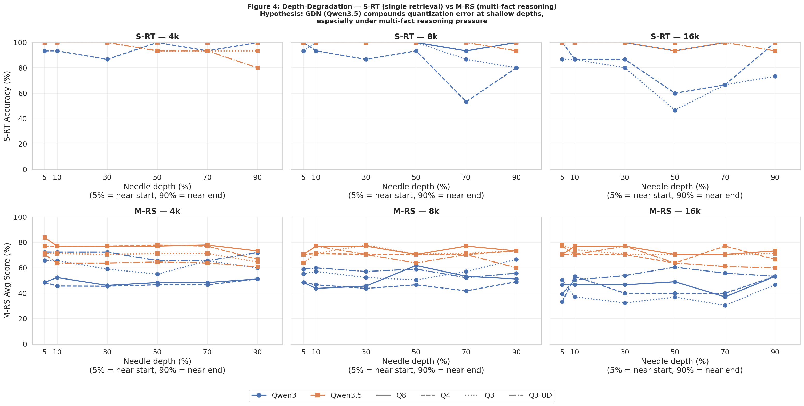
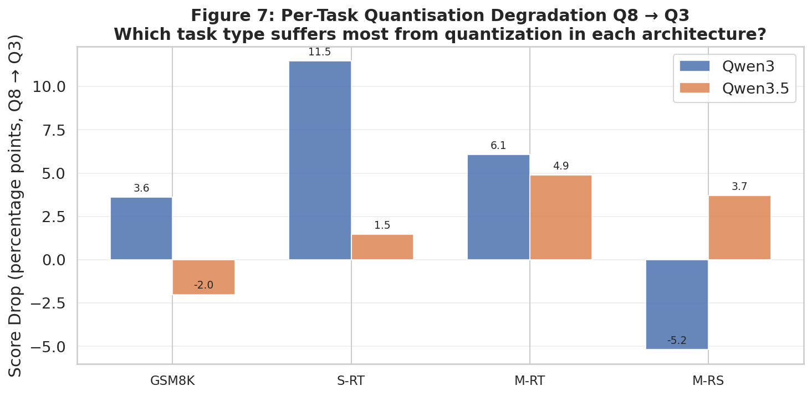
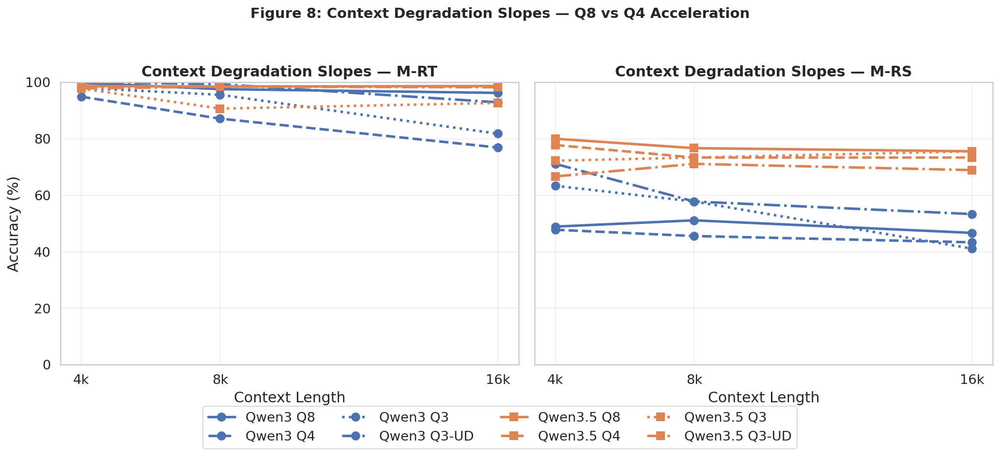
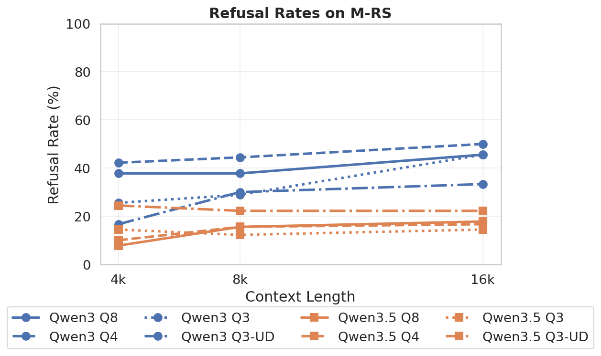

# Quantization Effects on Transformer vs Gated DeltaNet Architectures

This repository contains the experimental code and benchmarks for comparing quantization degradation between pure Transformer models (Qwen3) and hybrid Gated DeltaNet architectures (Qwen3.5).

## Research Question

**Main RQ:** How does weight quantization impact the long-context retrieval degradation of hybrid Gated DeltaNet architectures compared to pure Transformers?

## Repository Structure

```
├── models/              # Downloaded GGUF models (not in git)
├── results/             # Benchmark outputs
│   ├── completed/       # Finished benchmark JSONs (auto-moved)
│   └── figures/         # Generated plots (PNG + PDF)
├── src/                 # Source code
│   ├── download_models.py   # Model downloader with retry
│   ├── perplexity.py        # WikiText-103 perplexity benchmark
│   ├── gsm8k.py             # GSM8K math reasoning benchmark
│   ├── needlebench.py       # OpenCompass NeedleBench (S-RT, M-RT, M-RS)
│   ├── run_all.py           # Batch runner with pause/resume
│   ├── state.py             # State management for crash recovery
│   ├── analyze.py           # Results analysis and plotting (7 figures)
│   └── debugpipeline.py     # 1-sample sanity check for all models/tasks
└── requirements.txt     # Python dependencies
```

## Quick Start

### 1. Install Dependencies

```bash
# Create virtual environment
python -m venv .venv
source .venv/bin/activate

# Install llama-cpp-python with CUDA
CMAKE_ARGS="-DGGML_CUDA=on" pip install llama-cpp-python --force-reinstall --no-cache-dir

# Install other dependencies
pip install -r requirements.txt
```

### 2. Download Models

```bash
python src/download_models.py
```

Downloads 6 GGUF models (~18GB total):
- **Qwen3-4B** (pure Transformer): Q8_0, Q4_K_M, Q3_K_M, UD-Q3_K_XL
- **Qwen3.5-4B** (GDN hybrid): Q8_0, Q4_K_M, Q3_K_M, UD-Q3_K_XL

### 3. Sanity Check (optional)

```bash
python src/debugpipeline.py
```

Runs 1 sample per task per model to verify the full pipeline before committing to the full run.

### 4. Run Benchmarks

```bash
# Start or resume benchmarks (auto-resumes by default)
python src/run_all.py

# Start fresh (ignore any saved state)
python src/run_all.py --fresh
```

**Pause/Resume:** Press `Ctrl+C` to pause. State is saved automatically. Run the same command later to resume.

### 5. Analyze Results

```bash
python src/analyze.py
```

Generates 7 comparison figures in `results/figures/` (PNG + PDF).

## Benchmarks

| Benchmark | Purpose | Context | Est. Time |
|-----------|---------|---------|-----------|
| **WikiText-103 Perplexity** | Raw information loss per quant level | 2048 | ~2 hrs total |
| **GSM8K (250 samples)** | Short-context reasoning control | 2048 | ~4.5 hrs total |
| **NeedleBench S-RT** | Single-needle retrieval by depth | 4k/8k/16k | ~5 hrs total |
| **NeedleBench M-RT** | Multi-needle retrieval by depth | 4k/8k/16k | ~8 hrs total |
| **NeedleBench M-RS** | Multi-fact reasoning by depth | 4k/8k/16k | ~8 hrs total |

**NeedleBench grid:** 3 tasks × 3 context lengths × 6 depths (5/10/30/50/70/90%) × 15 samples = 810 evaluations per model (4,860 total)

**Total runtime:** ~23–25 hours on RTX 4060 8GB (flash attention + n_batch=256)

## Generated Figures

| # | Figure Content | Preview |
|---|----------------|---------|
| 1 | WikiText-103 perplexity by quantization level |  |
| 2 | GSM8K accuracy — short-context control |  |
| 3 | NeedleBench heatmap (task × context × quant) |  |
| 4 | **Depth-degradation curves — S-RT + M-RS (thesis figure)** |  |
| 5 | Per-task Q8→Q3 degradation deltas |  |
| 6 | Context-degradation slopes |  |
| 7 | Refusal rates (Qwen3 vs Qwen3.5) |  |

## Hardware Requirements

- **GPU:** NVIDIA GPU with CUDA support (tested on RTX 4060 8GB)
- **RAM:** 16GB+ recommended
- **Storage:** ~20GB free space (18GB models + results)
- **OS:** Linux (tested on Debian, benchmarked in headless TTY)

## Scoring

All three NeedleBench tasks use `composite_retrieval_score = max(levenshtein_soft_score, predicted_coverage_score, substr_score)` with a 0.5 correctness threshold. This is format-agnostic — concise extractions and full-sentence answers both score correctly.

## Citation

See the paper for methodology details and citations.


